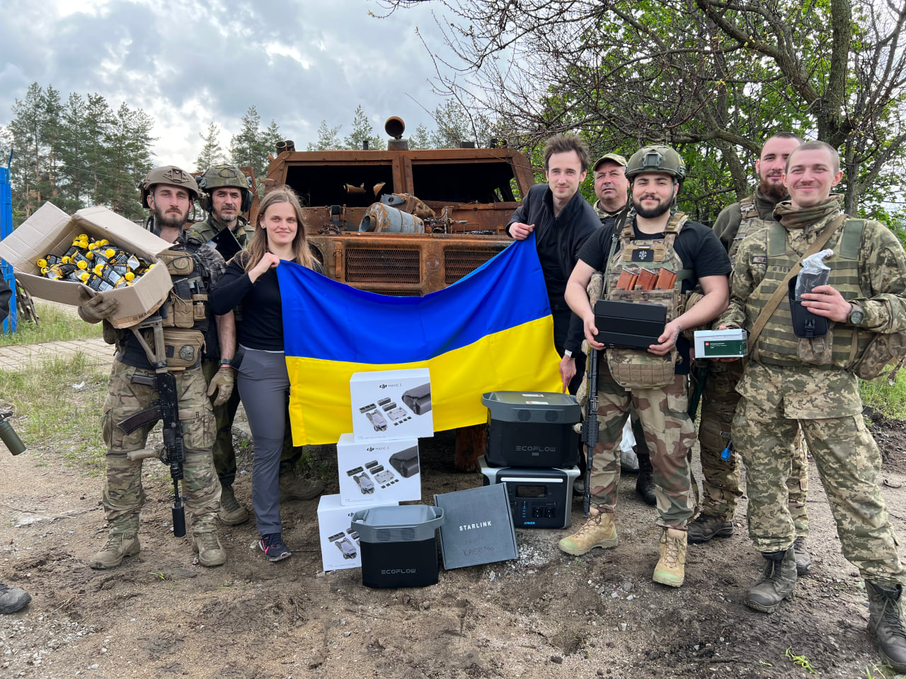
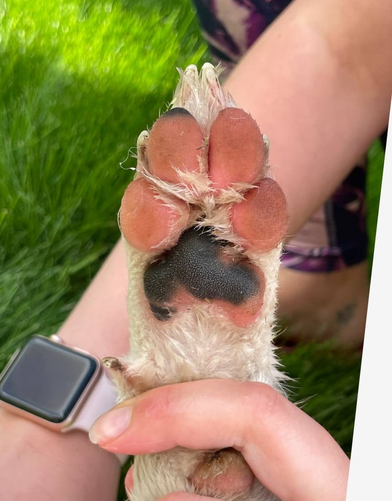
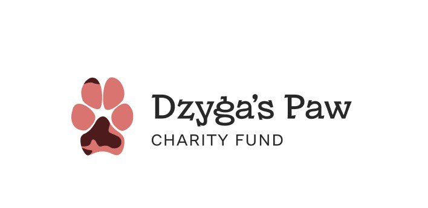
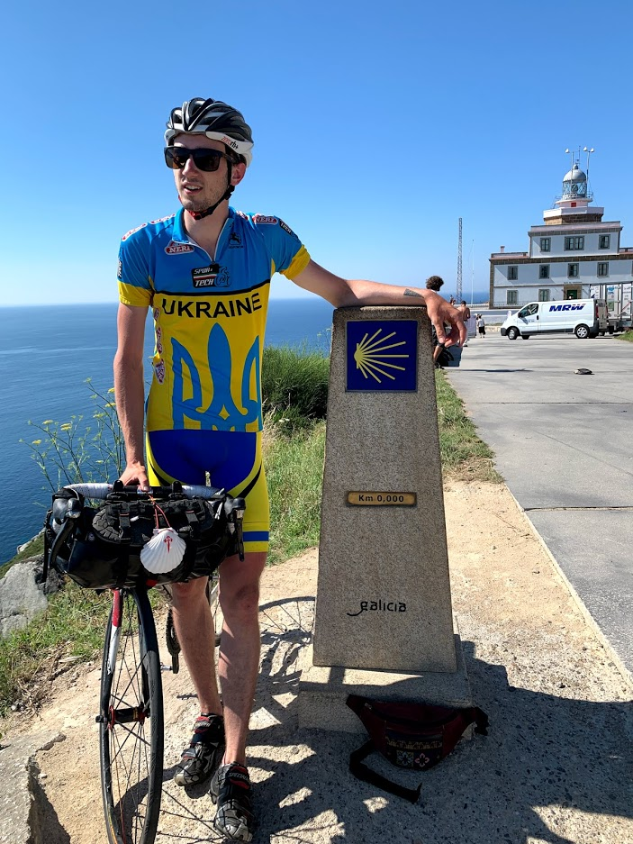
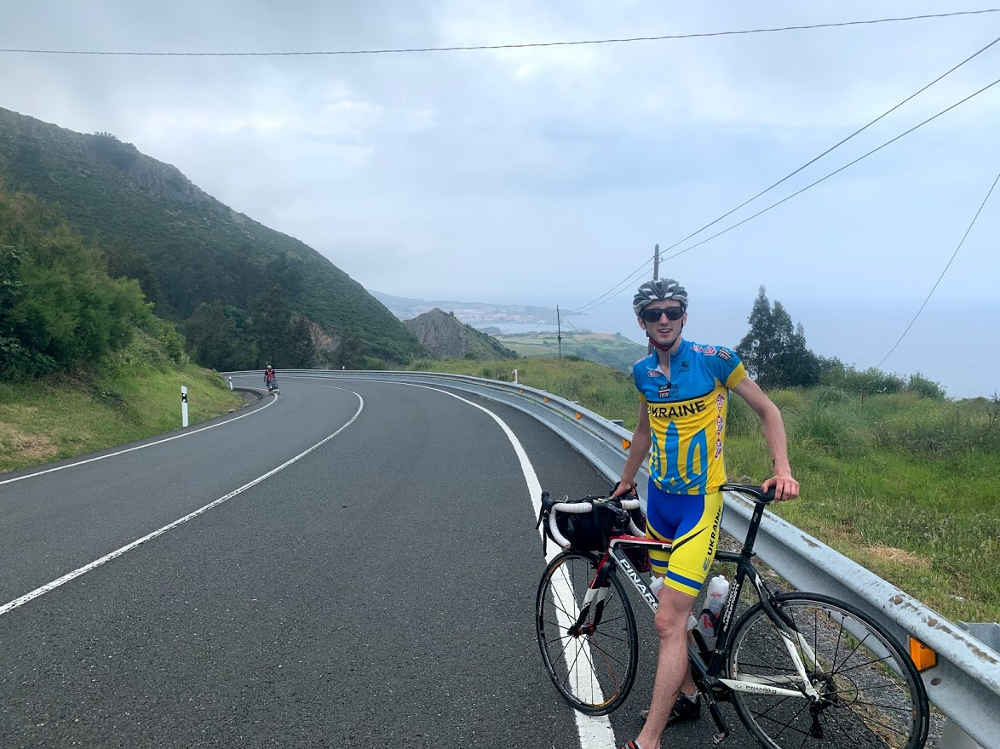
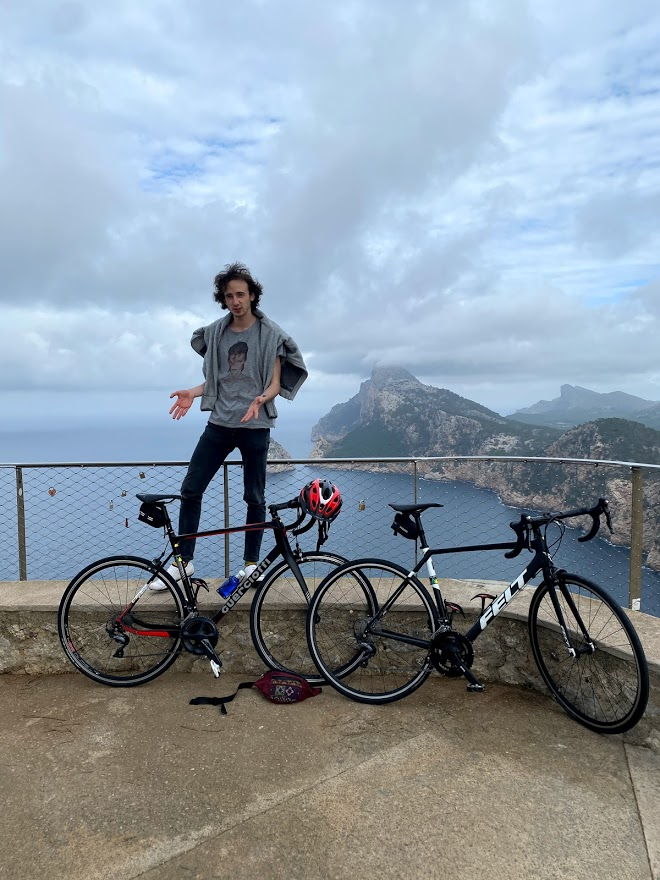

### Dimko, Ukrainian charity fund leader

I have created a charity fund in the name of my dog Dzyga - Dzyga's Paw!

[dzygaspaw.com](dzygaspaw.com)

I am Ukrainian and my country has been invaded in 2014 by Russia. The invasion was very barbaric and I was not able to deal with my IT duties while my countrymen were tortured and killed by Russian forces.

So, I decided to do my best to help Ukrainian Forces win, eliminate Russians once and forever, push the invaders out of my country.
24th February 2022, when the most recent Russian barbaric invasion began, I decided quit my IT job and dedicate myself solely to volunteering efforts. By activating all of my connections in the military, I decided to help various units where he had friends – so they can fight better. Drones, StarLinks, night vision, radios, generators, EOD equipment – all of that I initially bought using my own savings, realizing that this is a war for survival of Ukrainian nation.

I also started sharing these efforts in public on my [Twitter page](twitter.com/dim0kq), and immediately people started donating towards my work after seeing it’s honest and genuine, and makes real impact. Over a few months, I've been able to send more than 100 parcels to my military friends, and gather more than 600 000 USD from small donations.

That’s how Dzyga’s Paw originated – a charity fund aimed at supplying Ukrainian military in Russo-Ukrainian war, in the name of Dzyga dog who wants to live in free independent Ukraine, and, therefore, gives her paw of help to Ukrainian fighters!

If you want to support me personally, not charity fund, please refer to [patreon.com/dimko](patreon.com/dimko) and [buymeacoffee.com/dim0kq](https://www.buymeacoffee.com/dim0kq). Thanks! 

### Dimko, the community leader👋

I am leader of local software engineering community @lvivdotnet. This passion incorporates inspiring people by introducing them into the community of other people who professionally are different from them thus there is always a room for learning or mentoring for somebody. The main idea behind is not to only have tech talks which bring practical value (and could be pretty much seen on YouTube) but to have people connect in the community, meaning introduce them to the group projects, have them discuss contraversial topics, collaborate, make new friends, and learn from each other.

And me, as a community leader, is responsible for all my people to feel safe, to have a place to discuss things and to get inspired by me and other members. 

This won't be possible without my:
- strong interpersonal skills
- competence and technological awareness which makes me able to review all the talks coming in
- confidence in what I'm doing because I've got the vision - the vision to not only become better person and professional, but to make other people around me do so as well
- enthusiam which keeps on driving me for ages
- DDD - Drop Delegate Do - the approach for identifying really required things, delegating what's feasible to delegate and doing the most important thing myself, this approach made it not look like a mess
- belief in others
- a couple of beers at the afterparties

So, what do I do?
- Inspire people by my example and by example of people I bring to the community
- Organizing monthly events for ~100ppl by finding the location, negotiating with partners, finding appropriate speakers, deeply reviewing their talks and in the end is running the event itself at the spot
- Running the [website](https://lviv.dotnet.city/)
- Running the [FB page](https://www.facebook.com/lvivdotnet)
- Running the [Twitter account](https://twitter.com/lvivdotnet)
- Running the [Telegram chat](https://t.me/lvivdotnet)
- Connecting with global partners such as Microsoft, JetBrains, OzCode to get the best stuff for my people
- Connecting with local partners in Ukraine so we can develop local market
- Creating full-day conferences such as Global Azure Bootcamp 2017 Lviv, Global Azure Bootcamp 2018 Lviv, Global Azure Bootcamp 2019 Lviv, and, unfortunately, no Global Azure Bootcamp 2020 Lviv since I decided to cancell it in favor of not letting anybody get hurt by the corona thing.
- Connecting the communities by involving foreign speakers, creating shared events with other communities

### Dimko, the software engineer

Tinkering with software since 13 years old, so far gone... 
I've been doing anything you can think of - embedded, mobile, web, distributed systems, product, fixed scope, outstuff, outsource, team extension, architecture, consulting. You call it anyhow, I call it problem solving. This is what I do profesionally. 

Nowadays I'm building distributed systems as Software Engineer with great passion for architecture, infrastructure, teamwork and XP workflows.

### Dimko, the cyclist

The first solo cycling trip I took when I was 3 years old - my dad let me go to the local shop for the ice-cream on my own. The distance was tremendous - around 300 meters.
 
I felt the spirit of freedom, the wind in my ears, the power you put into pedalling, all the fancy looks at me - and I knew cycling is getting me through the life.

Starting from that point, I started mastering cycling - like street, BMX, freeride, trails, road, track, unicycle - literally anything. I did some professional road cycling back in the day, but found that to be too dangerous, even tho it's still one of my favorite hobbies - to cycle! 

