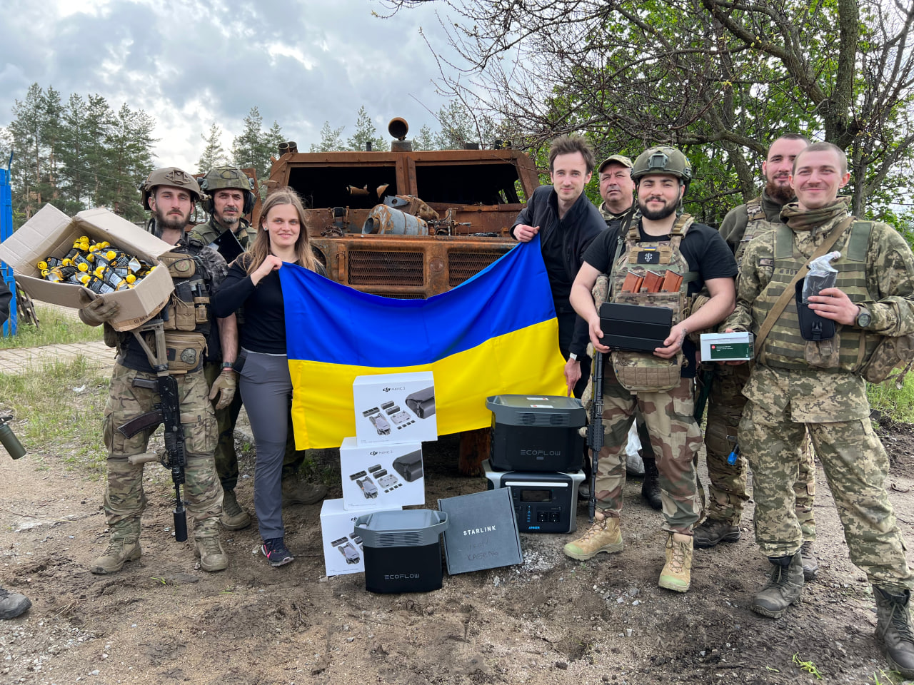

# Hey, I'm Dimko 👋

Ex-tech lead, now a Ukrainian warfighter and founder of a charity fund.

## 🪖 Warfighter

413th Regiment "RAID", Ukraine's Unmanned Systems Forces. Started with drones and EW, now in Lessons Learned & Innovation: what works at the front, what doesn't, and how not to step on the same rake twice.

## 🐾 Dzyga's Paw

In February 2022 I quit IT and started buying gear for friends at the front. People on [Twitter](https://x.com/dim0kq) started chipping in, and it grew into [Dzyga's Paw](https://dzygaspaw.com): $7M+ of tech delivered to 100+ units, donors from 70+ countries, [every dollar public](https://dzygaspaw.com/transparency).

Named after our dog Dzyga - well, her paw 🐕

👉 [Donate](https://dzygaspaw.com/support) · Support me personally: [Patreon](https://patreon.com/dimko) · [Buy Me a Coffee](https://www.buymeacoffee.com/dim0kq)

## 📚 Also

- Wrote [a book](https://kovyla.pub/dimko) about Ukrainian resilience
- Master's in Public Administration at UCU
- Ex-tech lead, ex-leader of [@lvivdotnet](https://lviv.dotnet.city/). Code is on pause, pinned repos are from that life
- Cyclist since age 3: road, BMX, freeride, track, even unicycle 🚲
